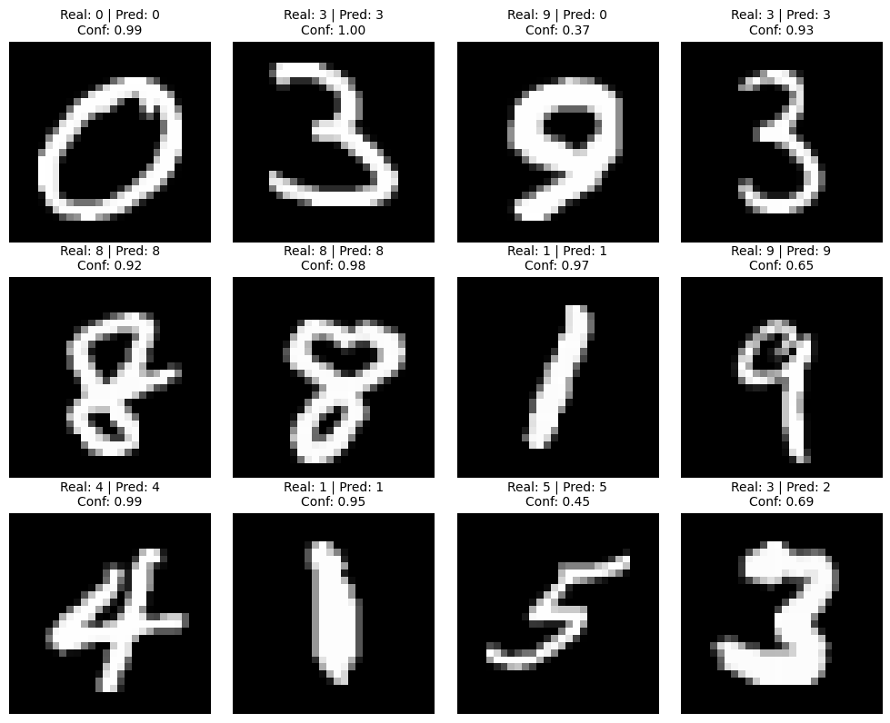
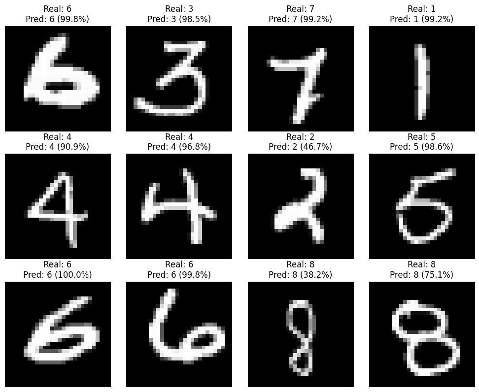
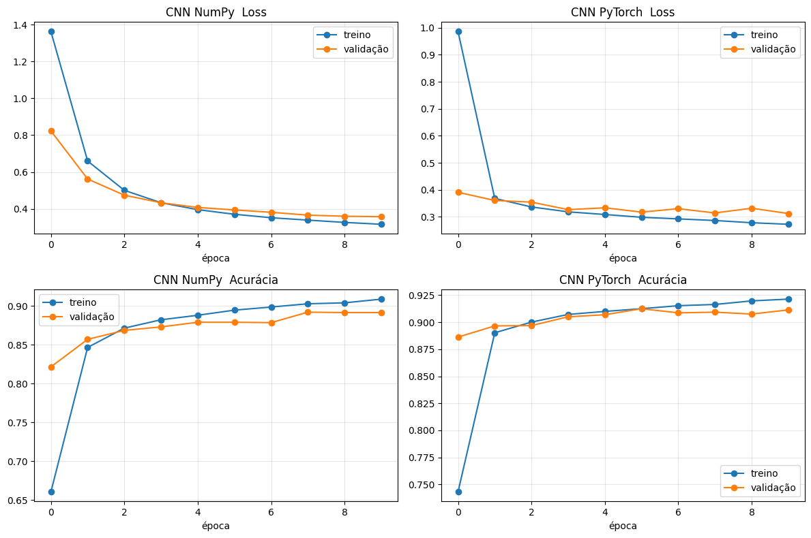

# CNN for MNIST Dataset

Implementação de uma Rede Neural Convolucional para o clássico problema de reconhecimento de dígitos manuscritos (MNIST / Kaggle Digit Recognizer), feita em duas etapas: primeiro uma CNN construída **do zero com NumPy** (para entender o que de fato acontece dentro de uma camada convolucional), depois a mesma tarefa resolvida com **PyTorch**.

Todo o desenvolvimento está no notebook [`CNN_for_MNIST.ipynb`](CNN_for_MNIST.ipynb).

## 1. CNN implementada do zero (NumPy)

A ideia dessa parte foi implementar manualmente uma camada convolucional, sem usar nenhum framework de deep learning, para deixar explícito o que uma `Conv2d` faz por baixo dos panos.

**Arquitetura:**
- 1 camada convolucional: 8 filtros de 3x3 (`W1`), sem padding, stride 1 → saída `8 x 26 x 26`
- ReLU
- Flatten → vetor de 5408 posições
- Camada densa (fully connected) de 5408 → 10 (`W2`, `B2`)
- Softmax → probabilidades das 10 classes (dígitos 0-9)

**Passos da implementação:**
1. **Forward manual em uma única imagem** — a convolução é feita primeiro com laços `for` explícitos, deslizando cada kernel 3x3 sobre a imagem 28x28 e calculando a soma ponderada + bias em cada posição.
2. **Backward manual** — cálculo do gradiente da loss (cross-entropy) em relação a `W2`, `B2`, `W1` e `B1`, propagando o erro da camada densa de volta pela ReLU até a camada convolucional.
3. **Vetorização** — a convolução com laços é substituída por uma versão vetorizada usando `numpy.lib.stride_tricks.sliding_window_view`, que extrai todas as janelas 3x3 de uma vez e transforma a convolução em uma única multiplicação de matrizes. O mesmo é feito no backward (`conv_vectorized` / `backward_vectorized`), o que acelera bastante o treinamento em Python puro.
4. **Treinamento em lote** — as funções são organizadas em `init_params`, `forward`, `backward_vectorized`, `gradient_descent` e `evaluate`, e o modelo é treinado por gradiente descendente estocástico (imagem por imagem) em um subconjunto do dataset.

**Resultado (10 épocas, 5000 imagens de treino):**

| Split | Loss | Acurácia |
|---|---|---|
| Treino | 0.3156 | 90.88% |
| Validação | 0.3568 | 89.15% |
| Teste | 0.3326 | 90.05% |



## 2. A mesma tarefa com PyTorch

Depois de validar o entendimento manual, a rede foi reimplementada com `torch.nn`, permitindo uma arquitetura mais profunda e treino no dataset completo.

**Arquitetura (`CNN(nn.Module)`):**
- `Conv2d(1 → 8, kernel_size=3)` + ReLU
- `Conv2d(8 → 16, kernel_size=3)` + ReLU
- Flatten
- `Linear(16*24*24 → 10)`

**Treinamento:** `CrossEntropyLoss` + `SGD(lr=0.01)`, 10 épocas, batches de 128, split 70% treino / 15% validação / 15% teste (estratificado por label).

**Resultado (10 épocas, dataset completo):**

| Split | Loss | Acurácia |
|---|---|---|
| Treino | 0.2724 | 92.13% |
| Validação | 0.3123 | 91.13% |
| Teste | 0.2949 | 91.25% |



> A comparação entre as duas CNNs não é pareada: a versão NumPy treinou com 5000 amostras e 1 camada convolucional; a versão PyTorch treinou com o dataset completo (~29 mil amostras) e 2 camadas convolucionais. Mesma tarefa, condições diferentes — o objetivo não foi comparar performance, e sim mostrar a evolução de "entender a mecânica" para "usar o framework".



## 3. Submissão no Kaggle

O modelo treinado em PyTorch foi usado para gerar as predições sobre o `test.csv` oficial da competição [Digit Recognizer](https://www.kaggle.com/c/digit-recognizer), salvas em `submission.csv` no formato `ImageId, Label`.

**Score obtido no Kaggle: `0.91414`**

## Estrutura do projeto

```
CNN_for_MNIST.ipynb   # notebook com toda a implementação (NumPy + PyTorch)
imagens/               # gráficos e exemplos de predição usados neste README
train.csv             # dados de treino (Kaggle Digit Recognizer)
test.csv              # dados de teste (Kaggle Digit Recognizer)
submission.csv        # arquivo de submissão gerado
requirements.txt      # dependências do projeto
```

## Como rodar

```bash
python -m venv venv
source venv/bin/activate
pip install -r requirements.txt
jupyter notebook CNN_for_MNIST.ipynb
```
